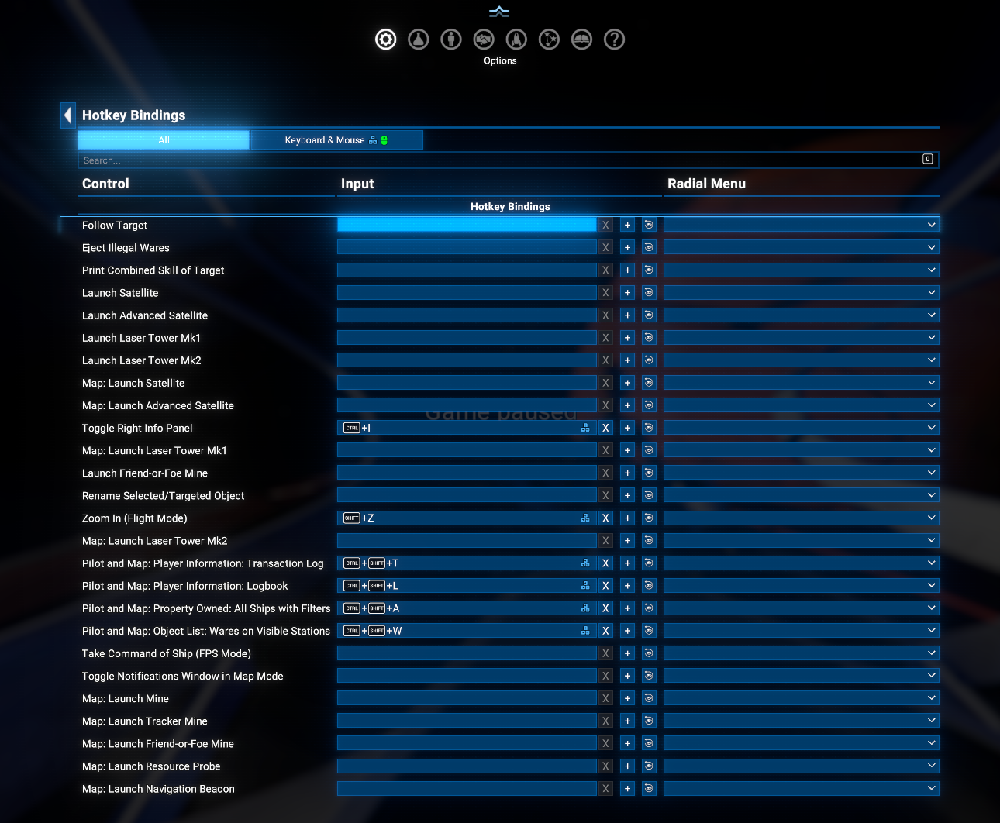
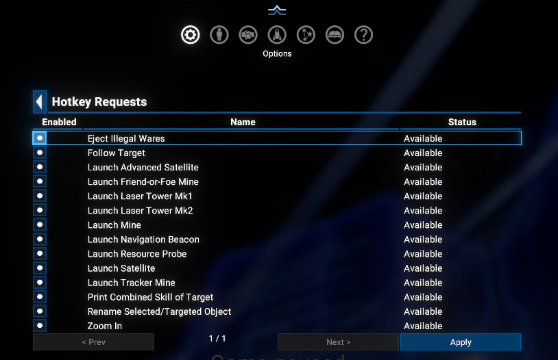

# Simple Hotkeys

A small, growing collection of simple hotkey actions for X4: Foundations, built on top of the [Native Hotkey API](https://www.nexusmods.com/x4foundations/mods/2181) - every action below is bindable by the player through the native game keybinding UI, just like a vanilla control.

## Overview

This mod doesn't add any UI of its own. It registers a set of small, focused actions with the *Native Hotkey API*, which then exposes them on its own **Hotkey Management > Hotkey Bindings** page (under Options), where the player assigns the actual physical key through the same native remap UI (and conflict-detection) every other control uses.

Most actions only fire while the player is actually piloting their own ship (no menu open); a couple are map-only instead - see each action's description below for where it applies.

## Requirements

- **X4: Foundations**: Version **9.00** or higher.
- **Native Hotkey API** by Chem O`Dun, version **8.00.03** or higher:
  - Available on Nexus Mods: [Native Hotkey API](https://www.nexusmods.com/x4foundations/mods/2181)
  - Available on Steam Workshop: [Native Hotkey API](https://steamcommunity.com/sharedfiles/filedetails/?id=3750545906)
- Indirectly depends on the **UI Extensions and HUD** mod by kuertee, which is a dependency of the *Native Hotkey API*:
  - For Game Version **8.00HF4** or higher - Version **v8.0.4.9** or higher on Nexus Mods: [UI Extensions and HUD](https://www.nexusmods.com/x4foundations/mods/552)
  - For Game Version **9.00** or higher - Version **v9.0.0.6** or higher on Nexus Mods: [UI Extensions and HUD](https://www.nexusmods.com/x4foundations/mods/552)

## Installation

- **Steam Workshop**: [Native Hotkey API](https://steamcommunity.com/sharedfiles/filedetails/?id=3751021954)
- **Nexus Mods**: [Simple Hotkeys](https://www.nexusmods.com/x4foundations/mods/2183)

## Hotkey Actions

All of the actions below show up automatically on the *Native Hotkey API*'s **Hotkey Bindings** page once this mod is enabled - there is nothing to configure here, just assign a key to whichever ones you want to use.

- **Rename Selected/Targeted Object** - opens the vanilla rename popup for the selected (map) or targeted (piloting) object, if it's player-owned.
- **Follow Target** - engages autopilot to the current target (which tracks a moving target, i.e. "follow"); pressed again on the same target, it disengages autopilot instead.
- **Eject Illegal Wares** - drops all illegal cargo from the ship's hold and the player's own inventory, based on the local sector's police faction.
- **Print Combined Skill of Target** - shows a notification with the combined skill of the current target's crew.
- **Zoom In (Flight Mode)** - piloting only: steps the camera FOV through increasing zoom factors (1x -> 2x -> 4x -> 8x) on repeated presses; pressing again once at the highest factor resets straight back to the FOV that was active before zooming started.
- **Launch Satellite / Launch Advanced Satellite** - launches a satellite or advanced satellite, if one is carried.
- **Launch Laser Tower Mk1 / Mk2** - launches a laser tower of the chosen mark, if one is carried.
- **Launch Mine / Launch Tracker Mine / Launch Friend-or-Foe Mine** - launches the chosen mine type, if one is carried.
- **Map: Launch ...** - map-only counterpart of every launch action above (Satellite, Advanced Satellite, Laser Tower Mk1/Mk2, Mine, Tracker Mine, Friend-or-Foe Mine), plus **Map: Launch Resource Probe** / **Map: Launch Navigation Beacon** (no piloting counterpart - vanilla already has hotkeys for those from the ship you're piloting): launches onto the selected player-owned ship on the map instead of the ship you're piloting, if it's carrying one.
- **Toggle Right Info Panel** - map only: toggles the map's right-side info panel for the current selection, mirroring the existing sidebar icon (there's no vanilla hotkey for either side's info panel, only mouse clicks).
- **Take Command of Ship (FPS Mode)** - lets you take the pilot/flight-control seat of the ship you're walking in via hotkey, where appropriate "option" is shown on walking crosshair. Requires the Hotkey API version 8.00.05!

Please not forget - you can disable any of these actions in appropriate **Hotkey Requests** section of the *Native Hotkey API*'s menu, if you don't want to use them.

## Credits

- **Author**: Chem O`Dun, on [Nexus Mods](https://next.nexusmods.com/profile/ChemODun/mods?gameId=2659) and [Steam Workshop](https://steamcommunity.com/id/chemodun/myworkshopfiles/?appid=392160)
- *"X4: Foundations"* is a trademark of [Egosoft](https://www.egosoft.com).

## Acknowledgements

- [EGOSOFT](https://www.egosoft.com) - for the X series.
- [kuertee](https://next.nexusmods.com/profile/kuertee?gameId=2659) - for the `UI Extensions and HUD` that the *Native Hotkey API* (and therefore this mod) relies on.

## Changelog

### [1.03] - 2026-07-05

- **Added**
  - Take Command of Ship (FPS Mode) - takes the pilot/flight-control seat of the ship you're walking in via hotkey, without needing to double-click the native prompt.
  - Map-only counterpart of the entire deployable launch family (Satellite, Advanced Satellite, Laser Tower Mk1/Mk2, Mine, Tracker Mine, Friend-or-Foe Mine, Resource Probe, Navigation Beacon) - launches onto the selected player-owned ship on the map instead of the ship you're piloting. Resource Probe / Navigation Beacon reintroduce the two deployables removed in 1.02, now map-only.

### [1.02] - 2026-06-30

- **Added**
  - Toggle Right Info Panel (map only) - no vanilla hotkey exists for either side's info panel, only mouse clicks.
- **Removed**
  - Launch Navigation Beacon / Launch Resource Probe - vanilla already has native hotkeys for these (`Deploy Navigation Beacon` / `Deploy Resource Probe`).
- **Changed**
  - Renamed Zoom In to Zoom In (Flight Mode) to make clear it only works while piloting.

### [1.01] - 2026-06-28

- **Fixed**
  - Minor bug fixes and improvements.

### [1.00] - 2026-06-24

- **Added**
  - Initial version: rename selected/targeted object, follow target, eject illegal wares, print combined skill of target, zoom in/reset, and the full deployable launch family (satellites, navigation beacon, resource probe, laser towers, mines).
